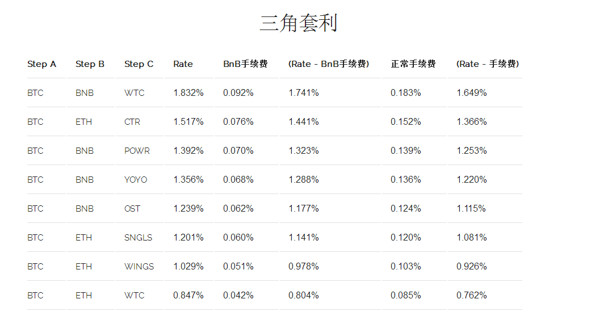

# triangular-arbitrage
数字货币-三角套利机器人

## 计算公式 
- 套利后获得值 = 1/A价格/B价格/C价格x换回A的价格
- 利润率= （套利后持有值-之前持有值）/之前持有值

## 配置
1、config/default.org.toml 改为 config/default.toml

2、config/default.toml文件中配置修改，例如：币安apikey

## 启动步骤

```js
npm install
npm start
```


<p align="center"></p>

## 疑难解答

Q：toml配置如何改为json配置?

A：可以把toml后缀改成json,然后通过[这个地址](https://toml-to-json.matiaskorhonen.fi/)，把toml格式配置转换成json格式。