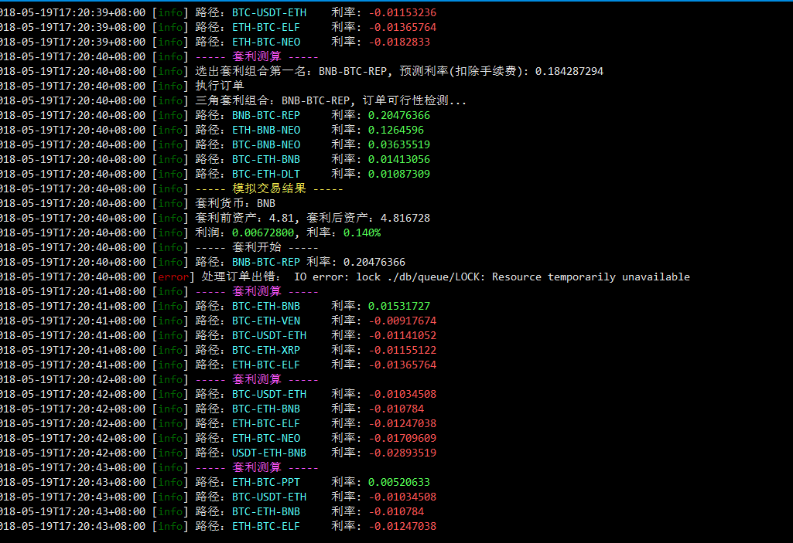
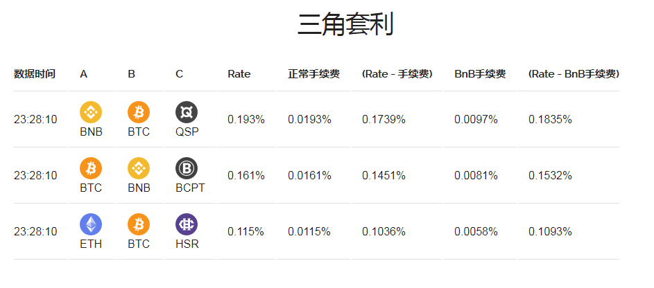
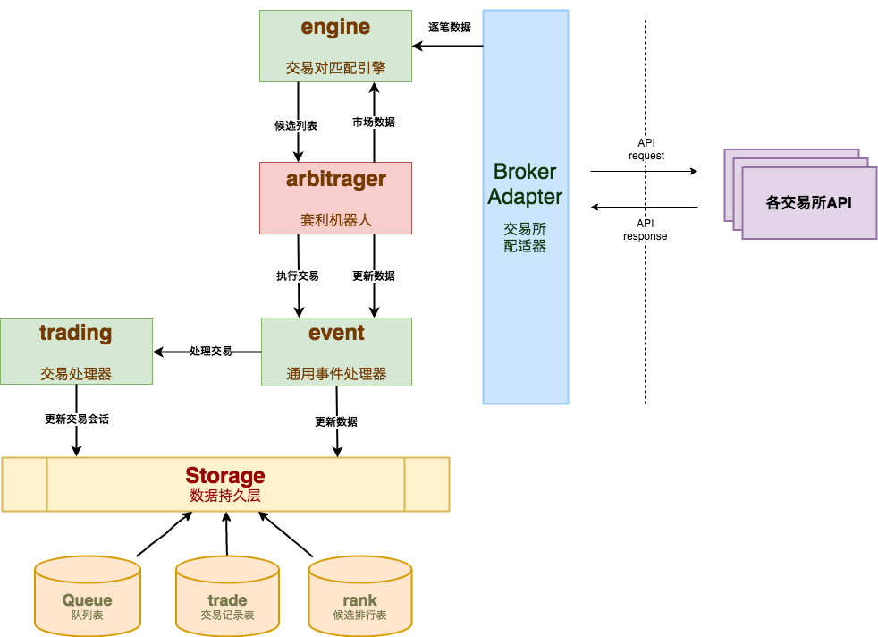
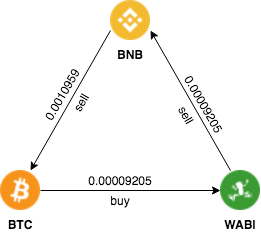
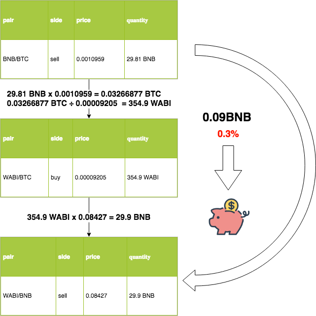

# triangular-arbitrage
数字货币-三角套利机器人


## 配置
1、config/default.org.toml 改为 config/default.toml

2、config/default.toml文件中配置修改，例如：币安apikey

## 启动步骤
启动自动套利程序步骤

```js
// 只在第一次安装程序时需要运行
npm install
// 启动自动套利主程序
npm start
```

## 控制台运行效果
<p align="center"></p>


## web服务启动步骤

非必须启动项，只对想看的排行页面的同学需要如下配置

- 下载并安装CouchDB数据库
https://couchdb.apache.org/#download

- default.toml配置

找到storage项目中的`url = ""`改为`url = "http://127.0.0.1:5984"`

- CMD切换到项目路径，执行如下命令
```js
npm run ws
```

## 页面显示
打开`127.0.0.1：3000`后，显示如下：
<p align="center"></p>

## 系统构成图
<p align="center"></p>

## 概念图
<p align="center"></p>
<p align="center"></p>

## 交易程序交流 QQ 群
310298370

## 疑难解答

Q：toml配置如何改为json配置?

A：可以把toml后缀改成json,然后通过[这个地址](https://toml-to-json.matiaskorhonen.fi/)，把toml格式配置转换成json格式。
